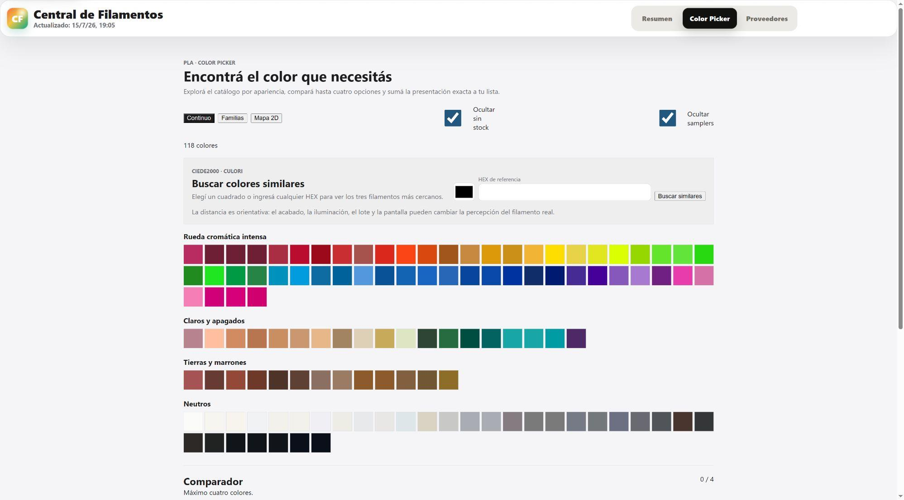
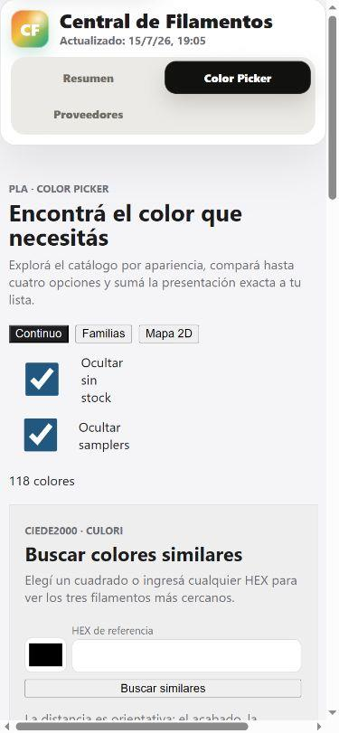
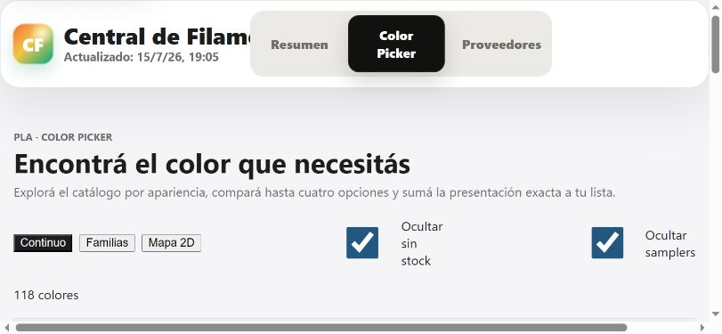

# Auditoría automatizada de UI/UX — 2026-07-16

## Veredicto

La UI quedó corregida y lista para usar la auditoría responsive y WCAG automatizable como barrera de calidad. La verificación final pasó en Chrome para 4K, 2K, 1080p, laptop, tres anchos móviles y móvil horizontal, sin overflow, fallas de foco ni violaciones axe serias o críticas.

La rama aislada `codex/ui-ux-automation-audit` contiene tanto la infraestructura reproducible como las correcciones de producción y sus regresiones automatizadas.

## Estado posterior a las correcciones

- Overflow, breakpoints, header horizontal, totales móviles, modal y densidad responsive: corregidos.
- H1, skip link, foco tras elegir un color, `aria-current`, errores asociados y región live: corregidos.
- Contrastes AA y objetivos táctiles, incluidos mapa y lista de cotización: corregidos.
- Favicon, entradas Vite y disparadores de publicación de las cinco páginas: corregidos.
- Vite actualizado a 8.0.16; ya no figura entre las vulnerabilidades de `npm audit`.
- Permanecen cinco avisos sólo de desarrollo, transitivos de `@lhci/cli`; no existe una actualización segura sin forzar un downgrade mayor a 0.1.0.

## Alcance

Vistas verificadas:

- Resumen/catálogo: `/CentraldeFilamentos/`
- Color Picker: `/CentraldeFilamentos/color-picker.html`
- Estadísticas de proveedores: `/CentraldeFilamentos/estadisticas.html`

Viewports:

| Perfil | Tamaño |
|---|---:|
| 4K | 3840 × 2160 |
| 2K | 2560 × 1440 |
| 1080p | 1920 × 1080 |
| Laptop | 1366 × 768 |
| Móvil grande | 412 × 915 |
| Móvil | 390 × 844 |
| Móvil compacto | 360 × 800 |
| Móvil horizontal | 844 × 390 |

Se verificaron carga, errores de consola/red, imágenes rotas, overflow, controles recortados, jerarquía de encabezados, teclado/foco, flujo de cotización, estados dinámicos del Color Picker, axe WCAG 2 A/AA/2.1/2.2, peso de recursos y tiempos locales.

## Resultados automatizados

| Suite | Resultado | Lectura |
|---|---:|---|
| Matriz UI completa | 59 pasan, 109 omisiones por proyecto | 168 casos declarados; las omisiones evitan repetir flujos profundos fuera de sus viewports representativos. |
| Runtime y responsive | 32/32 pasan | Ocho resoluciones; tres vistas; sin overflow, controles recortados ni jerarquía rota. |
| Cotización profunda | 2/2 pasan | Desktop 1080p y móvil 390: agregar, foco del drawer, caja x12, cobertura, mensaje y WhatsApp. |
| Color Picker profundo | 10/10 pasan | Desktop y móvil: vistas, error/resultado accesible, foco, skip link y tooltips de borde. |
| Axe representativo | 8/8 pasan | Resumen, Color Picker, Estadísticas y estado HEX dinámico sin violaciones serias o críticas. |
| Objetivos táctiles | 4/4 pasan | Controles primarios, quitar ítem y puntos del mapa alcanzan 44 × 44 px. |
| Presupuestos locales | 24/24 pasan | Tres vistas en las ocho resoluciones dentro de los límites de navegación y peso. |
| Python | 251/251 pasan | Contratos de frontend y pipeline completos. |
| JavaScript unitario | 32/32 pasan | Color Picker 14/14; cotización y cobertura 18/18. |
| Build Vite | Pasa | Vite 8.0.16, 288 módulos y las cinco páginas generadas. |
| Lighthouse CI | Evidencia parcial; runner bloqueado | Completó tres auditorías de la primera URL y midió FCP ≈ 1,2 s, pero `chrome-launcher` falla al borrar el perfil temporal en Windows aun fuera del sandbox. |

## Hallazgos iniciales — resueltos

La lista siguiente conserva el diagnóstico que motivó las correcciones; todos los puntos de UI, accesibilidad y publicación quedaron cubiertos por la verificación posterior. Lighthouse sigue limitado por su limpieza temporal en Windows y los avisos transitivos de LHCI se documentan como riesgo de tooling.

### Alta prioridad

1. **Color Picker genera scroll horizontal.** Se midieron 101 px extra a 360 px, 85 px a 390 px, 90 px en 844 × 390 y 13 px en 1366 × 768. En móvil el scrollbar es visible. Los tooltips generados por CSS amplían el ancho aunque estén ocultos.
2. **El header se corta en móvil horizontal.** El layout mantiene tres columnas hasta 820 px, por lo que 844 × 390 cae justo fuera del breakpoint móvil y recorta marca/navegación.
3. **Pérdida de foco al elegir un color similar.** El botón activado desaparece al recalcular resultados y `document.activeElement` termina en `body`, en desktop y móvil. Riesgo WCAG 2.4.3.
4. **El skip link no transfiere foco.** Cambia el hash y desplaza, pero `#main-content` no recibe foco. Riesgo WCAG 2.4.1.
5. **Contraste AA insuficiente.** Axe confirmó, entre otros, navegación 4.27:1, texto secundario 4.37:1, controles azules alrededor de 4.25–4.28:1 y deltas de stock alrededor de 3.79–4.25:1, por debajo de 4.5:1 para texto normal.
6. **Resumen y Estadísticas no tienen H1.** Color Picker sí tiene uno; las otras dos vistas exponen cero `h1` en todas las resoluciones.
7. **Objetivos táctiles pequeños.** Hay swatches de 34 px, campanas de 34 px, botones `+1` de 40 × 36 px y puntos del mapa entre 12 y 24 px; varios no alcanzan WCAG 2.5.8.

### Prioridad media

8. El Resumen desborda 9 px en 844 × 390 y el breakpoint 820/821 crea un salto brusco entre tabla móvil y desktop.
9. Los totales móviles se ocultan por debajo de 1100 px porque `.summary-mobile-totals` permanece en `display: none`.
10. El modal de imagen cuadrado puede superar la altura útil en 844 × 390 y no define `max-height`/scroll interno.
11. Las tarjetas de estadísticas y la fila intradía quedan demasiado densas en móvil horizontal; el KPI grid mantiene tres columnas incluso a 360 px.
12. El mapa 2D depende de posición/tamaño para transmitir significado, pero el lector de pantalla recibe una secuencia plana de botones.
13. Resultados similares aparecen sin región live y el error HEX no está asociado al input mediante `aria-describedby`.
14. La navegación activa usa una clase visual pero no `aria-current="page"`.

### Operación y mantenimiento

15. Todas las vistas solicitan `/favicon.ico` y reciben 404.
16. `.github/workflows/pages.yml` no observa `color-picker.html`; un cambio exclusivo a ese HTML no dispara publicación.
17. `npm audit` informa 6 vulnerabilidades de desarrollo: 2 bajas, 2 moderadas y 2 altas. Las altas están en Vite 8.0.13 y `tmp` transitivo de LHCI. No se aplicó un `audit fix` automático.
18. En 4K/2K el contenido conserva un máximo cercano a 1180 px. No se rompe, pero desaprovecha mucho espacio horizontal y reduce la ventaja de esas pantallas.

## Fortalezas confirmadas

- El flujo completo de cotización pasa en 1920 × 1080 y 390 × 844.
- El drawer es modal, enfoca inicialmente el botón cerrar y devuelve el foco al disparador.
- La lista persiste localmente, permite caja x12, compara cobertura y arma mensajes individuales de consulta.
- Los tiles de color son botones nativos con nombre accesible, stock y `aria-pressed`.
- El HEX inválido usa `aria-invalid` y `role="alert"`.
- No se detectaron imágenes rotas visibles ni excepciones JavaScript fatales en la matriz.
- `prefers-reduced-motion` está contemplado en componentes clave.

## Evidencia visual aceptada

### Desktop



### Móvil 390 px

El scrollbar inferior confirma el reflow defectuoso.



### Móvil horizontal 844 × 390 en Chrome



## Cómo ejecutar

```text
npm ci
npm run build
npm run test:ui
npm run audit:lighthouse
```

`npm run test:ui` deja reporte HTML en `playwright-report/` y evidencia de fallos en `test-results/`. La automatización de GitHub está en `.github/workflows/ui-audit.yml` y conserva artefactos durante 14 días.

## Limitaciones de evidencia

- Axe detecta reglas automatizables; no sustituye NVDA/VoiceOver ni una revisión cognitiva con usuarios.
- Los presupuestos de rendimiento locales no tienen throttling de red/CPU. Lighthouse quedó configurado, pero su corrida multi-muestra fue bloqueada por permisos temporales de Chrome en esta máquina.
- Los datos del catálogo cambian con el pipeline. El smoke usa los datos actuales; para regresiones visuales estrictas conviene sumar un fixture estable en una segunda fase.
