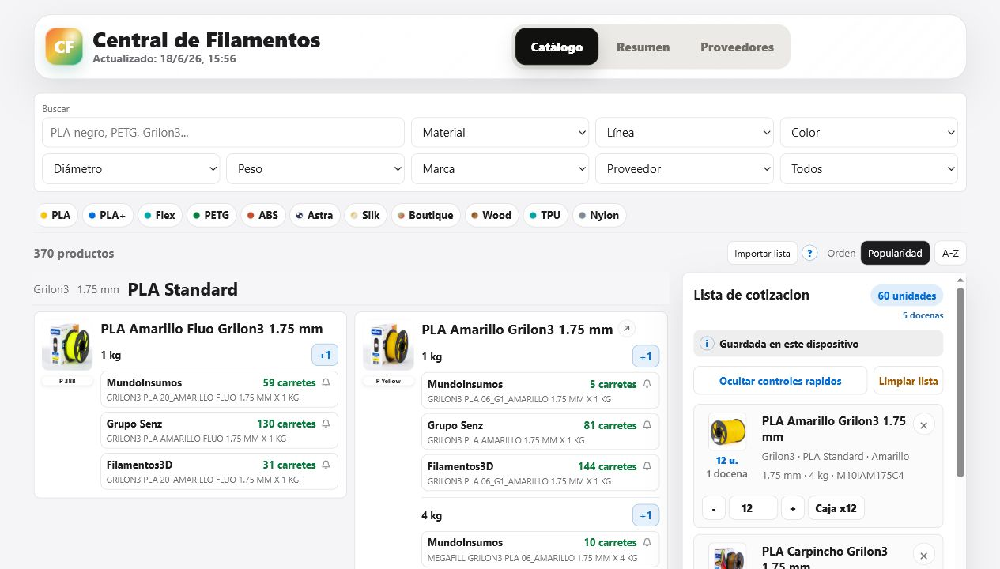
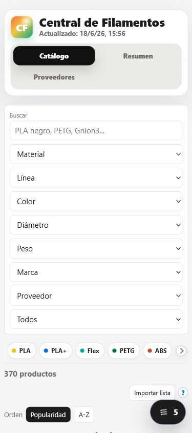
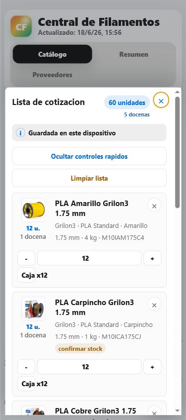
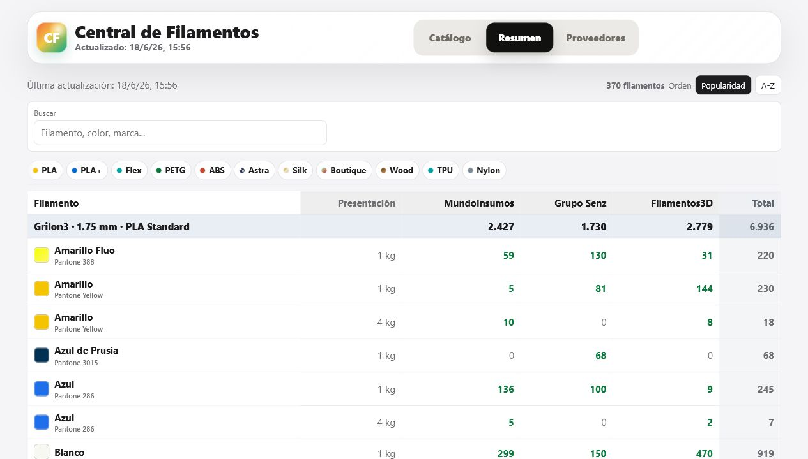
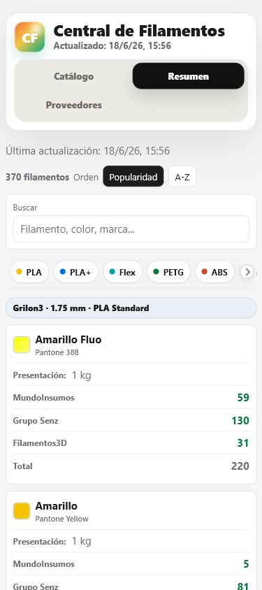
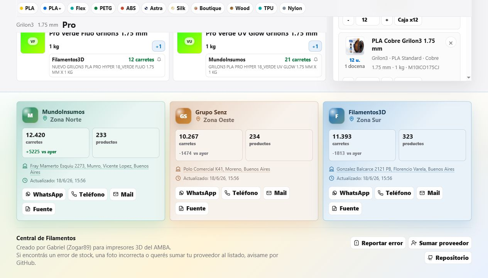

# Auditoria UX/UI - Central de Filamentos

Fecha: 2026-06-20

## Alcance

Auditoria combinada de UX, UI responsive y accesibilidad probable sobre:

- Catalogo y filtros.
- Tarjetas de producto y accion `+1`.
- Lista de cotizacion en desktop y mobile.
- Cobertura por proveedor y salida a WhatsApp.
- Vista Resumen.
- Seccion de proveedores.

Objetivo principal: que un maker encuentre filamentos, arme una lista y llegue a una consulta de cotizacion con el menor esfuerzo mental posible, sin confundir la plataforma con una tienda.

## Evidencia

## Fortalezas

- El producto ya resuelve un flujo real de punta a punta: buscar, comparar, planificar y consultar.
- La lista lateral fija funciona bien en desktop y conserva contexto con el catalogo.
- En mobile, el boton flotante hace visible la lista sin ocupar espacio permanente.
- Las miniaturas y muestras de color mejoran mucho el reconocimiento rapido.
- La jerarquia entre unidades y docenas ya es clara.
- La cobertura por proveedor convierte datos de stock en una decision accionable.
- El drawer tiene dialogo modal, foco inicial, trampa de foco y restauracion de foco.
- Existe soporte para `prefers-reduced-motion` en las animaciones actuales.
- Importar/exportar y el aviso de guardado local generan confianza y portabilidad.

## Riesgos estructurales

### P0 - El primer viewport mobile queda tomado por controles

La cabecera y ocho filtros consumen casi toda la pantalla. Los productos, que son el contenido principal, apenas aparecen despues del primer scroll.

**Cambio propuesto:** mostrar inicialmente busqueda + tres filtros principales (`Material`, `Color`, `Proveedor`) y agrupar el resto bajo `Mas filtros`. Cuando haya filtros secundarios activos, mostrar un contador y chips removibles.

### P0 - La lista mezcla tres etapas en una sola columna

Edicion de cantidades, comparacion de proveedores y preparacion del mensaje compiten dentro del mismo scroll. En listas largas, llegar a WhatsApp exige atravesar todos los items.

**Cambio propuesto:** dividir la lista en tres vistas compactas:

1. `Lista`: productos y cantidades.
2. `Proveedores`: cobertura de los tres proveedores.
3. `Enviar`: mensaje y WhatsApp del proveedor seleccionado.

En desktop pueden ser tabs dentro del panel. En mobile, un control segmentado fijo bajo el encabezado del drawer.

### P0 - Falta una progresion visible del trabajo

La interfaz tiene todas las piezas, pero no expresa claramente el recorrido `Elegir -> Revisar -> Consultar`.

**Cambio propuesto:** usar estado y copy contextual. Al agregar el primer producto, abrir una confirmacion breve. En la lista, el CTA principal cambia segun etapa: `Comparar proveedores` y luego `Preparar consulta`.

### P1 - Agregar un producto tiene poco feedback

El `+1` cambia el estado, pero no confirma de forma evidente que el item se agrego o aumento.

**Cambio propuesto:** durante 700 ms, transformar `+1` en un check con la cantidad actual, animar suavemente el contador de la lista y remarcar el item existente si ya estaba agregado. Sin toast global para cada click.

### P1 - Demasiados contenedores compiten visualmente

Filtros, tarjetas, ofertas, lista, items, cobertura y mensaje usan bordes similares. La interfaz se entiende, pero tiene mucho ruido de caja dentro de caja.

**Cambio propuesto:** reservar borde completo para tarjetas de producto y items de lista. Usar separadores, fondos sutiles y espacio para ofertas, avisos y cobertura. El CTA principal debe ser el elemento con mayor contraste, no otro borde mas.

### P1 - La jerarquia de acciones de la lista no refleja el riesgo

`Ocultar controles rapidos` y `Limpiar lista` reciben peso parecido. Limpiar es destructivo y frecuente por error en mobile.

**Cambio propuesto:** mover `Limpiar lista` a un menu de acciones junto con importar/exportar y pedir confirmacion solo cuando haya mas de un item. Mantener `Controles de cantidad` como toggle secundario.

### P1 - La cobertura muestra demasiado detalle antes de necesitarlo

Cada proveedor lista nuevamente todos los productos. Es correcto, pero alarga el panel y retrasa el mensaje.

**Cambio propuesto:** mostrar primero una matriz compacta de proveedores con `3/5`, total cubierto y estado general. Al elegir uno, desplegar solamente faltantes y coincidencias dudosas; dejar los cubiertos completos dentro de `Ver detalle`.

### P1 - El Resumen mobile repite una lista larga sin herramientas de lectura

La adaptacion a tarjetas es legible, pero se pierde la ventaja comparativa de la tabla. No hay acceso rapido a proveedor dominante, faltantes o diferencias.

**Cambio propuesto:** conservar las tarjetas, agregar una fila resumen de tres proveedores con stock y usar un selector `Todos / Con stock / Faltantes`. Mantener encabezado de categoria sticky.

## Riesgos de accesibilidad

- Los `select` del catalogo no exponen nombres accesibles claros en el arbol; solo la busqueda tiene etiqueta visible. Agregar `label` asociado o `aria-label` preciso.
- Varios objetivos tactiles miden entre 16 y 36 px (`campana`, `+1`, cerrar, restar/sumar). Conviene apuntar a 44 px en mobile y mantener al menos 36 px en desktop compacto.
- Algunos estados dependen principalmente de color, por ejemplo stock verde y cobertura. Mantener icono o texto junto al color.
- El tooltip de importacion depende de hover/foco; en touch debe abrir como popover al tocar y cerrarse de forma predecible.
- Los cambios de cantidad deberian anunciarse en una region `aria-live` breve, sin repetir toda la lista.
- Las tabs de proveedor necesitan asociar `aria-controls`/`id` y soportar flechas izquierda/derecha para completar el patron de tabs.
- La animacion infinita de la pista horizontal llama la atencion de forma permanente. Debe detenerse despues de una o dos repeticiones, ademas de respetar movimiento reducido.

## Sistema de movimiento recomendado

El movimiento debe explicar causa y efecto. No usar animaciones ambientales continuas.

| Momento | Movimiento | Duracion |
| --- | --- | --- |
| Hover/foco de botones | color + elevacion de 1 px | 120-160 ms |
| Agregar unidad | check, contador y pulso localizado | 180-240 ms |
| Insertar/quitar item | opacidad + desplazamiento vertical de 6 px | 180-220 ms |
| Abrir drawer/popover | opacidad del fondo + `translateY` | 220-280 ms |
| Cambiar tab de lista | fundido y desplazamiento de 4 px | 160-200 ms |
| Actualizar cobertura | cambio numerico y resaltado localizado | 180-240 ms |

Usar solamente `transform` y `opacity` para las transiciones principales. En `prefers-reduced-motion: reduce`, conservar cambios de color/estado y eliminar desplazamientos, escalados y pulsos.

## Microinteracciones propuestas

1. `+1` confirma con check y cantidad actual sin mover la tarjeta.
2. El contador flotante hace un pulso unico cuando cambia, no solo cuando aparece.
3. Al completar una caja, `Caja x12` muestra brevemente `12 -> 24` o la siguiente cantidad resultante.
4. Copiar lista o mensaje cambia a `Copiado` con check durante dos segundos.
5. El proveedor seleccionado actualiza el resumen con una transicion corta y conserva el foco.
6. Los filtros activos aparecen como chips removibles debajo de la busqueda.
7. Al dejar cero resultados, ofrecer `Limpiar filtros` y explicar que combinacion no encontro coincidencias.
8. La lista vacia debe mostrar una sola instruccion breve y una accion para volver al catalogo.

## Direccion visual

- Mantener la identidad clara, liviana y utilitaria actual.
- Reducir sombras grandes; usarlas para elementos flotantes o modales, no para cada superficie.
- Dar mas contraste jerarquico a acciones: neutro para editar, azul para avanzar y verde solo para WhatsApp/confirmacion.
- Simplificar el fondo de proveedores. Los tres colores ayudan a distinguirlos, pero el resplandor general y las tarjetas coloreadas juntos compiten. Mantener el color en una franja, icono o encabezado por proveedor.
- Unificar radios en 6-8 px para superficies y usar circulos solo para iconos, contadores o avatars.
- Conservar tipografia compacta, pero subir a 12 px los metadatos interactivos que hoy aparecen a 10-11 px.

## Plan recomendado

### Pase 1 - Flujo y densidad

- Filtros progresivos en mobile.
- Tabs `Lista / Proveedores / Enviar`.
- Matriz compacta de cobertura.
- Jerarquia de acciones y menu para operaciones secundarias.

### Pase 2 - Feedback y movimiento

- Feedback localizado al agregar y cambiar cantidades.
- Transiciones del drawer, tabs e items.
- Estados `Copiado`, vacio, sin resultados y carga.
- Tokens CSS de duracion/easing y movimiento reducido.

### Pase 3 - Accesibilidad y terminacion

- Etiquetas de filtros y patron completo de tabs.
- Objetivos tactiles y foco visible consistente.
- Revision de contraste, zoom y reflow.
- QA visual en 390x844, 768x1024, 1280x720 y 1440x900.

## Recomendacion final

La mejora con mayor retorno no es agregar mas animacion, sino ordenar el flujo en etapas y despues animar las transiciones entre esas etapas. Eso haria que la herramienta se sienta mas rapida, incluso sin reducir funcionalidades.
